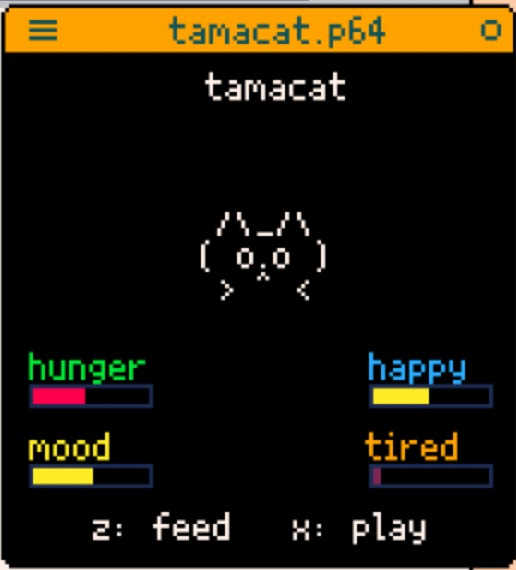

## my first pico8 game

NOW ON PICOTRON!

pico8 version

picotron64 version!!

first time coding a game, was pretty fun

thanks you james for porting it to picotron64 and helping me learn pico8!

# installation

1. download the p8 file and run in pico8/ download the p64 file and run in picotron64

2. have fun

# contributing

feel free to sumbit a pull request
